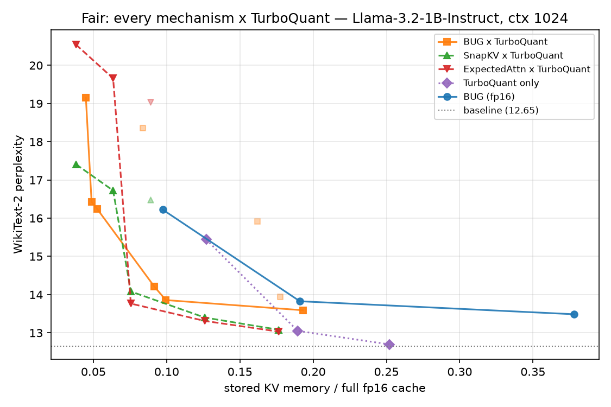

# kvdlra

**Streaming KV-cache compression for LLMs via Dynamical Low-Rank Approximation** — the
Ceruti–Lubich *BUG* integrator from numerical analysis
([arXiv:2010.02022](https://arxiv.org/abs/2010.02022),
[arXiv:2104.05247](https://arxiv.org/abs/2104.05247)) — composed with
[TurboQuant](https://arxiv.org/abs/2504.19874) residual quantization, wired into NVIDIA's
[kvpress](https://github.com/NVIDIA/kvpress) as `BUGPress`.

DLRA tracks a moving low-rank matrix without the σ_min stiffness that breaks naive (U, S, V)
ODE schemes, with a robust error bound *independent of the smallest singular value*. kvdlra
uses it as a principled, streaming, near-oracle alternative to greedy KV-cache eviction
heuristics (H2O, SnapKV).

## Result (honestly)



Perplexity vs. stored KV-cache memory (Llama-3.2-1B, WikiText-2, ctx 1024), **every
mechanism quantized equally** (the fair control). Low-rank (feature axis) and quantization
(bit axis) genuinely **compose** — 4-bit coordinates ~halve BUG's memory for a negligible
perplexity cost. But with a fair comparison, **BUG×TurboQuant is a *competitive* low-rank
compressor, not the winner**: Expected Attention×TurboQuant is on/ahead of BUG's Pareto
frontier through the mid-aggressive band, and pure 4-bit TurboQuant is near-lossless at
0.25×. **BUG wins only at the extreme edge (<0.07× memory)**, where token eviction turns
catastrophic and low-rank degrades gracefully. BUG's real case: extreme-compression
robustness, **needle-retrieval parity** with the best (SnapKV drops the needle; BUG doesn't),
and the **streaming/online** niche (Week 5). Full accounting — including the retracted
unfair-comparison claim — in [`docs/week4.md`](docs/week4.md).

## How it works

1. **Streaming BUG tracker** ([`integrators/streaming.py`](src/kvdlra/integrators/streaming.py),
   [`streaming_torch.py`](src/kvdlra/integrators/streaming_torch.py)) — a rank-adaptive
   augmented-BUG subspace tracker for the column-streamed KV matrix. Near-oracle: within
   1.01–1.03× of the truncated-SVD optimum, beating incremental SVD and Oja's rule
   ([`docs/week2-pilot.md`](docs/week2-pilot.md)). A blocked torch variant runs on GPU.
2. **`BUGPress`** ([`press/bug_press.py`](src/kvdlra/press/bug_press.py)) — a `kvpress` press
   that replaces the KV cache with its rank-`r` reconstruction during pre-fill, operating
   **pre-RoPE** (roughly halves the error). Preserves greedy generation; graceful perplexity
   degradation ([`docs/week3.md`](docs/week3.md)).
3. **TurboQuant** ([`quant/`](src/kvdlra/quant/)) — PolarQuant (rotated Lloyd–Max, within
   2.7× of the distortion floor) + QJL (1-bit, unbiased inner products), composed with BUG by
   quantizing the coordinate factors ([`docs/week4.md`](docs/week4.md)).

## Install

```bash
uv venv --python 3.12 && uv pip install -e ".[dev]"
uv run pytest -q          # 83 passed, 1 skipped (bf16 QR skips on CPU LAPACK)
```

## Reproduce the hero figure

```bash
uv run python scripts/w4_hybrid_sweep.py --ranks 32 64 128 --bits fp 4 3 2 \
    --context-len 1024 --target-len 512 --n-windows 16
uv run python scripts/w4_head_to_head.py --ratios 0.5 0.75 0.9 \
    --context-len 1024 --target-len 512 --n-windows 16
```

## Layout

- `src/kvdlra/integrators/` — BUG (`bug.py`, `bug_adaptive.py`), torch port (`bug_torch.py`),
  streaming trackers (`streaming.py` numpy, `streaming_torch.py` blocked/GPU)
- `src/kvdlra/press/` — `BUGPress` (`bug_press.py`), transformers≥5.8 compat shim (`compat.py`)
- `src/kvdlra/quant/` — TurboQuant: `polar.py` (PolarQuant), `qjl.py` (QJL)
- `scripts/` — KV capture, SV-decay figure, generation parity, perplexity + hybrid + head-to-head sweeps
- `docs/` — [plan](docs/PLAN.md), weekly writeups ([1](docs/week1.md), [2](docs/week2-pilot.md),
  [3](docs/week3.md), [4](docs/week4.md)), [conventions](docs/notes/conventions.md),
  [RoPE pitfall](docs/notes/rope-pitfall.md), [TurboQuant×RoPE](docs/notes/turboquant-rope-interaction.md)
- `paper/` — arXiv-style preprint draft (`main.tex`)

## Honest caveats

Absolute low-rank compression is moderate — the heavy-tailed KV spectrum limits pure
low-rank, and aggressive ranks cost real perplexity. Results are WikiText-2 perplexity at 1B
scale (not long-context LongBench/RULER); reported memory is the factored-storage cost.
8B scale-up is a documented follow-up. See each week's writeup for the full accounting.

## License

Apache-2.0.
