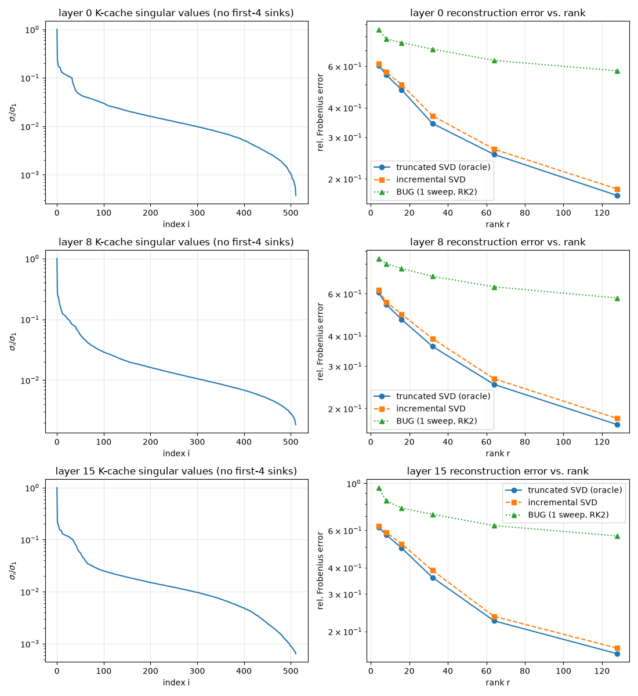

# Week 1 — KV-cache singular-value decay

**Milestone.** A reproducible singular-value-decay + reconstruction-error figure for the
**post-RoPE** K-cache of Llama-3.2-1B, plus from-scratch BUG integrators (fixed-rank +
rank-adaptive) validated against analytic references.



Layers 0/8/15, one C4 document (idx 15) at 2048 tokens, first 4 attention-sink tokens excluded.
`M` has rows = 512 features (8 KV heads × 64 head_dim), columns = 2044 tokens.

**Reproduce:**
```bash
python scripts/capture_kv.py --model unsloth/Llama-3.2-1B-Instruct --seq_len 2048 --doc_idx 15
python scripts/week1_sv_decay.py --dump dumps/llama3.2-1b/doc15_d1b3a6eb_len2048
# -> figures/week1/sv_decay.{pdf,png} + sv_decay.json (the plotted numbers, committed)
```

## What it shows

Relative Frobenius reconstruction error vs. rank (post-RoPE K-cache):

| rank r | truncated SVD (oracle) | incremental SVD | BUG (1 sweep, placeholder) |
|---|---|---|---|
| 32  | 0.34–0.36 | 0.37–0.39 | ~0.71 |
| 64  | 0.22–0.25 | 0.24–0.27 | ~0.63 |
| 128 | 0.16–0.17 | 0.17–0.18 | ~0.57 |

(SVD / incremental-SVD shown as ranges across layers 0/8/15; the BUG placeholder is
layer-invariant here. Exact per-layer numbers: `figures/week1/sv_decay.json`.)

## Interpretation (honest)

**Post-RoPE keys are not cleanly low-rank.** The singular spectrum has a sharp initial knee —
σ_i/σ_1 drops below ~0.05 by index ~40–55 — but then a **heavy tail** that decays only to
~1e-2 by index ~300. Because Frobenius error sums the discarded tail, even the
*oracle* truncated SVD needs rank ≈128 of 512 to reach ~17% error; rank 32 only reaches ~35%.

This is exactly the **RoPE pitfall** ([`docs/notes/rope-pitfall.md`](notes/rope-pitfall.md);
ShadowKV [arXiv:2410.21465](https://arxiv.org/abs/2410.21465) §3.1): rotary embeddings smear
low-rank structure across positions, so the cached (post-RoPE) keys are the *harder* object.
Incremental SVD tracks the oracle closely (a near-optimal streaming baseline). The Week-1 "BUG"
curve is the plan's **single-sweep, random-init placeholder** and underperforms SVD by design —
the real *streaming* BUG integrator is Week 2.

## Caveats

Single document; fp32 on CPU; **post-RoPE**; Llama-3.2-1B only. Captured with the ungated
`unsloth/Llama-3.2-1B-Instruct` mirror — advertised as verbatim Llama-3.2-1B weights, and
config-identical to the gated repo (verified: 32 attention / 8 KV heads, head_dim 64, 16 layers,
`LlamaForCausalLM`); the account lacks Meta's allowlist for `meta-llama/Llama-3.2-1B-Instruct`.

**wandb:** not logged (no `WANDB_API_KEY` this session); metrics are in the table above and the
experiment notebook. Provide a key to log/sync the run.

## Next

The post-RoPE result is the expected motivation to compress **pre-RoPE** keys (Week 2/3 — the
project's escalation trigger #1). This figure is the honest baseline, not a go/no-go verdict
(that is the Week-2 pilot). Next up: the streaming BUG on real KV streams, then the Week-2
go/no-go.
