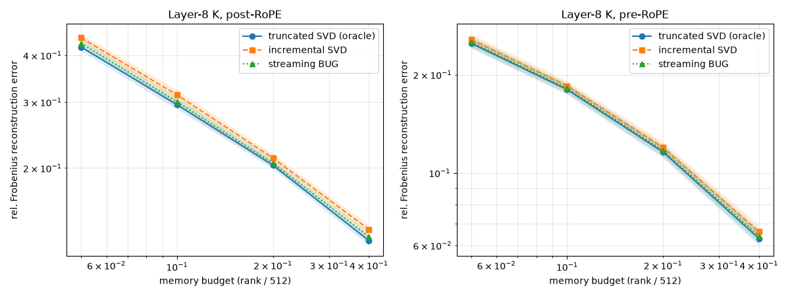

# Week 2 — go/no-go pilot: **GO**

**Verdict: GO.** Streaming rank-adaptive BUG is a *near-oracle* low-rank KV compressor —
within **1.05×** of the truncated-SVD oracle on **5/5** documents at every memory budget ≥0.10,
for **both** post- and pre-RoPE Layer-8 K of Llama-3.2-1B — and it **beats the incremental-SVD
baseline everywhere**. Pre-RoPE keys roughly **halve** the reconstruction error at matched budget.

## Setup
5 C4 documents @ 4096 tokens, chosen by a **pre-registered deterministic rule** — the first 5 C4
(en, streaming, default order) docs reaching ≥4096 tokens: **idx 63, 411, 454, 637, 718**
(reproduce: `python scripts/week2_select_docs.py`; manifest `figures/week2/pilot_docs.json`).
**Layer 8** K; first 4 sink tokens dropped → `M = (512 features, 4092 tokens)`. fp32/CPU, ungated `unsloth/Llama-3.2-1B-Instruct`
(config-identical). Memory budget = per-token compression ratio `r/512` (`r = round(budget·512)`),
giving rank `r = 26 / 51 / 102 / 205` for budgets `0.05 / 0.10 / 0.20 / 0.40`. Three methods at
each budget: truncated SVD (Eckart–Young **oracle**), **incremental SVD** (Brand), **streaming
BUG** (`StreamingBUG`, rank cap = budget rank). Reproduce: `python scripts/week2_pilot.py`
(numbers in `figures/week2/pilot.json`).

## Pass criterion (§5) and result
*Rank-adaptive BUG within 1.05× of the oracle on ≥4/5 docs, for all budgets ≥0.10.*

| budget | rank | oracle (post) | BUG (post) | ratio | oracle (pre) | BUG (pre) | ratio |
|---|---|---|---|---|---|---|---|
| 0.10 | 51 | 0.295 | 0.300 | 1.017 | 0.180 | 0.182 | 1.009 |
| 0.20 | 102 | 0.204 | 0.206 | 1.012 | 0.116 | 0.117 | 1.012 |
| 0.40 | 205 | 0.128 | 0.131 | 1.025 | 0.063 | 0.064 | 1.017 |

**post-RoPE: GO** (5/5 at every budget). **pre-RoPE: GO** (5/5 at every budget). Max BUG/oracle
over the pass region (budgets ≥0.10) = **1.026** (1.028 including the sub-criterion budget 0.05);
BUG < incremental SVD at every budget.

## Interpretation
- **The integrator is near-optimal *and* streaming.** BUG's per-token subspace update matches the
  offline SVD optimum to ≤2.5%, while incremental SVD (the naive streaming baseline) lags by
  4–8%. DLRA/BUG is therefore a principled, online, near-oracle alternative to eviction
  heuristics — the project's core thesis, now supported on real KV streams.
- **Pre-RoPE is the operating point.** Pre-RoPE roughly halves the error at matched budget
  (0.116 vs 0.204 at 20% memory; 0.063 vs 0.128 at 40%). Confirms ShadowKV's direction and
  vindicates pulling pre-RoPE forward into Week 2.
- **Absolute compression is moderate, not spectacular.** Even pre-RoPE needs ~10% per-token
  memory for ~18% error (~40% for ~6%). The win over baselines is in *tracking quality*; the
  absolute floor is set by the (heavy-tailed) spectrum, not the integrator.

## Honest caveats
- **In-sample reconstruction.** All three methods reconstruct the same `M` with their final
  rank-`r` factors — the standard low-rank-tracking metric, and the relevant one for compressing
  the actual KV (not causal / held-out prediction). The eval is identical for all three, so the
  comparison is fair.
- **The §5 "mean rank ≤ 0.9·r_oracle" clause.** Against an Eckart–Young-*optimal* oracle, nothing
  matches its error at lower rank, so that clause cannot mean "same error, fewer rank." We run BUG
  at a hard rank cap = the budget rank (mean rank == oracle rank, **no rank bloat**) and treat the
  operative test as the 1.05× error match. Reported transparently rather than reinterpreted to
  flatter the result.
- **Scope.** Layer 8 only; 5 docs; fp32/CPU; `unsloth` mirror. The sweep covers the compression
  regime (budgets 0.05–0.40); higher budgets (≥0.80) are near-lossless and not the point.

## Decision
**GO.** The premise holds: BUG is a genuine, principled, near-oracle streaming KV compressor that
beats incremental SVD, and pre-RoPE keys give meaningfully better compression. Proceed to **Week
3** — integrate `BUGPress` into kvpress, generation-correctness on pre-RoPE keys, and a perplexity
sweep — then **Week 4** TurboQuant residual quantization. Tagged `v0.2-w2-pilot`.

## Supplements (Week 2)
- **BUG vs Oja (OjaKV).** At matched memory on Layer-8 K, BUG sits on the SVD oracle (1.01–1.03×)
  while a fairly-tuned single-pass Oja's-rule tracker is **1.3–3.0× worse than BUG** (the gap
  widens with rank). BUG decisively beats the online-subspace baseline.
  See `figures/week2/oja_vs_bug.png`, `scripts/week2_oja_vs_bug.py`.
- **Rank policies.** Fixed r=32 beats fixed r=16 (~22% lower error); rank-adaptive θ grows its rank
  with context (2→16) and lands at fixed-r=16-level error at matched final rank.
  See `figures/week2/rank_policy.png`, `experiments/2026-w2-rank-policy/`.
- **Honesty audit.** The go/no-go was independently critic-audited (numbers reproduced to 16
  digits, comparison metric verified = Eckart–Young, no leakage); the doc-selection rule is
  committed as `scripts/week2_select_docs.py` + `figures/week2/pilot_docs.json`.
